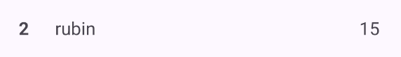
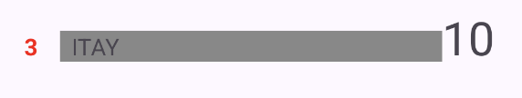
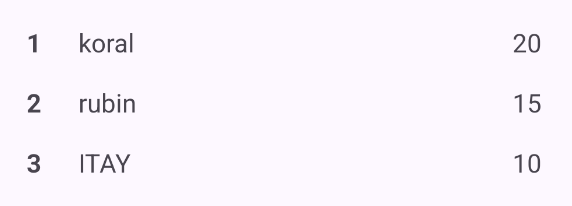
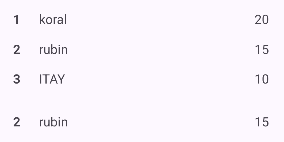

# Android Gamification SDK

**The Android Gamification SDK** is a powerful tool designed to help developers integrate player and achievement management into their Android applications. This SDK provides a comprehensive set of functions to manage players, track achievements, and display leaderboards and player ranks. It also includes built-in UI components for seamless integration into your app.

If you prefer to interact with the backend API directly without using the SDK, you can refer to the detailed API documentation available at WWW.API-SITE.com. The API site provides comprehensive information about all available endpoints, request/response schemas, and authentication requirements.
---

## Features

### 1. Player Management
- **Fetch All Players**: Retrieve a list of all players in the app.
- **Fetch Player by ID**: Get detailed information about a specific player.
- **Fetch Top Players**: Retrieve the top players based on their points.
- **Fetch Player Rank**: Get the rank of a specific player.
- **Add/Reduce/Set Points**: Manage player points dynamically.
- **Create/Delete Player**: Add or remove players from the system.
- **Set Player Username**: Update a player's username.

### 2. Achievement Management
- **Fetch All Achievements**: Retrieve a list of all achievements in the app.
- **Fetch Player Achievements**: Get achievements completed or pending for a specific player.
- **Check Player Achievement**: Verify if a player has completed a specific achievement.
- **Add/Remove Achievement**: Manage achievements for a specific player.

### 3. Built-in UI Components
- **PlayerRankView**: Displays a player's rank, username, and points.
- **TopPlayersView**: Displays a list of top players based on their points.

---

## Screenshots

<p align="center">PlayerRankView</p>
<p align="center">
    
    
</p>

<p align="center">TopPlayersView</p>
<p align="center">
    
    
</p>

---

## Installation

**To integrate the SDK into your Android project:**

1. **Add the SDK dependency**:
   Add the following dependency to your `build.gradle` file:
   ```gradle
   implementation 'com.example:gamification-sdk:1.0.0'
   ```

2. **Initialize the SDK**:
   In your `Application` class or `MainActivity`, initialize the SDK with your app ID and API key:
   ```java
   ApiController.setup("YOUR_APP_ID", "YOUR_API_KEY");
   ```

3. **Use the SDK functions**:
   Start using the SDK functions to manage players and achievements. For example:
   ```java
   ApiController.fetchAllPlayers(new ApiController.CallBack_Players() {
       @Override
       public void ready(List<Player> players) {
           // Handle the list of players
       }

       @Override
       public void failed(String message) {
           // Handle the error
       }
   });
   ```

4. **Add UI components**:
   Use the built-in UI components like `PlayerRankView` and `TopPlayersView` in your layouts:
   ```xml
   <com.example.gamificationsdk.PlayerRankView
       android:id="@+id/playerRankView"
       android:layout_width="match_parent"
       android:layout_height="wrap_content" />

   <com.example.gamificationsdk.TopPlayersView
       android:id="@+id/topPlayersView"
       android:layout_width="match_parent"
       android:layout_height="wrap_content" />
   ```

---

## Player Functions

### `fetchAllPlayers(CallBack_Players callBackPlayers)`
- **Description**: Fetches a list of all players in the application.
- **Callback**: `CallBack_Players`
  - `ready(List<Player> players)`: Returns a list of `Player` objects.
  - `failed(String message)`: Returns an error message if the request fails.

### `fetchPlayerById(String playerID, CallBack_Player callBackPlayer)`
- **Description**: Fetches a specific player by their unique ID.
- **Callback**: `CallBack_Player`
  - `ready(Player player)`: Returns a `Player` object.
  - `failed(String message)`: Returns an error message if the request fails.

### `fetchTopPlayers(int limit, CallBack_Players callBackPlayers)`
- **Description**: Fetches the top players based on their points, limited by the specified number.
- **Callback**: `CallBack_Players`
  - `ready(List<Player> players)`: Returns a list of `Player` objects.
  - `failed(String message)`: Returns an error message if the request fails.

### `fetchPlayerRank(String playerID, CallBack_Integer callBackInteger)`
- **Description**: Fetches the rank of a specific player.
- **Callback**: `CallBack_Integer`
  - `ready(Integer result)`: Returns the player's rank.
  - `failed(String message)`: Returns an error message if the request fails.

### `addPoints(String playerID, int amount, CallBack_Player callBackPlayer)`
- **Description**: Adds points to a specific player.
- **Callback**: `CallBack_Player`
  - `ready(Player player)`: Returns the updated `Player` object.
  - `failed(String message)`: Returns an error message if the request fails.

### `reducePoints(String playerID, int amount, CallBack_Player callBackPlayer)`
- **Description**: Reduces points from a specific player.
- **Callback**: `CallBack_Player`
  - `ready(Player player)`: Returns the updated `Player` object.
  - `failed(String message)`: Returns an error message if the request fails.

### `setPoints(String playerID, int amount, CallBack_Player callBackPlayer)`
- **Description**: Sets the points of a specific player to a specified amount.
- **Callback**: `CallBack_Player`
  - `ready(Player player)`: Returns the updated `Player` object.
  - `failed(String message)`: Returns an error message if the request fails.

### `createPlayer(Player newPlayer, CallBack_Player callBackPlayer)`
- **Description**: Creates a new player in the system.
- **Callback**: `CallBack_Player`
  - `ready(Player player)`: Returns the newly created `Player` object.
  - `failed(String message)`: Returns an error message if the request fails.

### `deletePlayer(String playerID, CallBack_Boolean callBackBoolean)`
- **Description**: Deletes a specific player from the system.
- **Callback**: `CallBack_Boolean`
  - `ready(Boolean result)`: Returns `true` if the player was successfully deleted.
  - `failed(String message)`: Returns an error message if the request fails.

### `setPlayerUsername(String playerID, String newUsername, CallBack_Player callBackPlayer)`
- **Description**: Updates the username of a specific player.
- **Callback**: `CallBack_Player`
  - `ready(Player player)`: Returns the updated `Player` object.
  - `failed(String message)`: Returns an error message if the request fails.

---

## Achievement Functions

### `fetchAllAchievements(CallBack_Achievements callBackAchievements)`
- **Description**: Fetches a list of all achievements in the application.
- **Callback**: `CallBack_Achievements`
  - `ready(List<Achievement> achievements)`: Returns a list of `Achievement` objects.
  - `failed(String message)`: Returns an error message if the request fails.

### `fetchPlayerAchievementsDone(String playerID, CallBack_Achievements callBackAchievements)`
- **Description**: Fetches a list of achievements that a specific player has completed.
- **Callback**: `CallBack_Achievements`
  - `ready(List<Achievement> achievements)`: Returns a list of `Achievement` objects.
  - `failed(String message)`: Returns an error message if the request fails.

### `fetchPlayerAchievementsUnfinished(String playerID, CallBack_Achievements callBackAchievements)`
- **Description**: Fetches a list of achievements that a specific player has not yet completed.
- **Callback**: `CallBack_Achievements`
  - `ready(List<Achievement> achievements)`: Returns a list of `Achievement` objects.
  - `failed(String message)`: Returns an error message if the request fails.

### `checkPlayerAchievement(String playerID, String achievementID, CallBack_Boolean callBackBoolean)`
- **Description**: Checks if a specific player has completed a specific achievement.
- **Callback**: `CallBack_Boolean`
  - `ready(Boolean result)`: Returns `true` if the player has completed the achievement.
  - `failed(String message)`: Returns an error message if the request fails.

### `getAchievementByPoints(int points, CallBack_Achievement callBackAchievement)`
- **Description**: Fetches an achievement based on the points required to complete it.
- **Callback**: `CallBack_Achievement`
  - `ready(Achievement achievement)`: Returns an `Achievement` object.
  - `failed(String message)`: Returns an error message if the request fails.

### `getAchievementByTitle(String title, CallBack_Achievement callBackAchievement)`
- **Description**: Fetches an achievement based on its title.
- **Callback**: `CallBack_Achievement`
  - `ready(Achievement achievement)`: Returns an `Achievement` object.
  - `failed(String message)`: Returns an error message if the request fails.

### `addAchievementToPlayer(String playerID, String achievementID, CallBack_Player callBackPlayer)`
- **Description**: Adds a specific achievement to a player's list of completed achievements.
- **Callback**: `CallBack_Player`
  - `ready(Player player)`: Returns the updated `Player` object.
  - `failed(String message)`: Returns an error message if the request fails.

### `removeAchievementFromPlayer(String playerID, String achievementID, CallBack_Player callBackPlayer)`
- **Description**: Removes a specific achievement from a player's list of completed achievements.
- **Callback**: `CallBack_Player`
  - `ready(Player player)`: Returns the updated `Player` object.
  - `failed(String message)`: Returns an error message if the request fails.

---

## Example App

An example app demonstrating the usage of this SDK will be provided soon. Stay tuned for updates!

---

## Contact

If you have any questions or need assistance, feel free to reach out to me at [itaybit10@gmail.com](mailto:itaybit10@gmail.com).

---

## Note to Recruiters

Please note that this SDK is part of my professional portfolio. If you’re interested in my work or would like to discuss potential job opportunities, feel free to reach out via the provided email. I am open to exploring new projects and opportunities.
